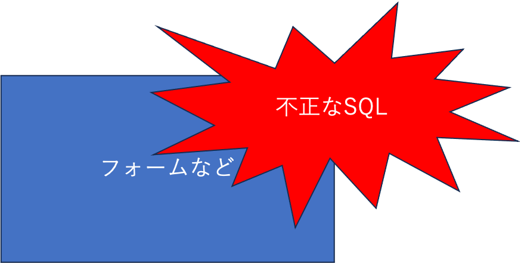
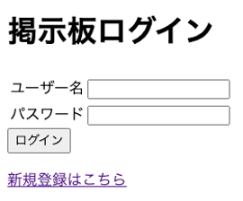
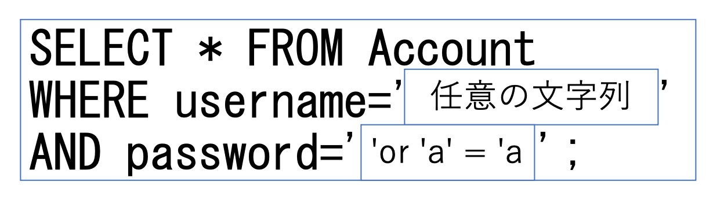

[TOC levels=1-3]
# SQLインジェクションとは
SQLインジェクションは、悪意のあるユーザーがアプリケーションに対して不正なSQLクエリを注入することによって発生するセキュリティ上の脆弱性です。SQLの呼び出しに不備があり、不正なSQLをアプリケーションが解釈することで発生します。これにより、攻撃者はデータベースに対して意図しないアクセスや操作を行うことができます。

# リスク
SQLインジェクションのリスクとして次のリスクが挙げられます。
- 情報漏洩
- 認証の回避
- データの改竄

# 攻撃例
今回はSQLインジェクションの攻撃の例として、実習に公開されている掲示板アプリを利用して認証の回避をしながらSQLインジェクションの仕組みについて解説します。

## 認証の回避
次のようなログインフォームで、ログイン時にSQLに入力値をそのまま埋め込み実行しているようなアプリケーションの場合、認証回避のリスクがあります。

例としてログイン時`SELECT * FROM Account WHERE username='ユーザ名' AND password='パスワード';`というSQLを呼び出している場合にユーザ名に任意の文字列、パスワードに`' or 'a' = 'a`という文字列を入力すると認証を回避されてしまいます。
これは入力値によって`SELECT * FROM Account WHERE username='任意の文字列' AND password='' or 'a' = 'a';`というSQL文が実行されてしまうため認証が回避されます。

# 対策方法
SQLインジェクションの対策方法としては、SQLの呼び出し時に静的プレースホルダを利用する方法があります。
